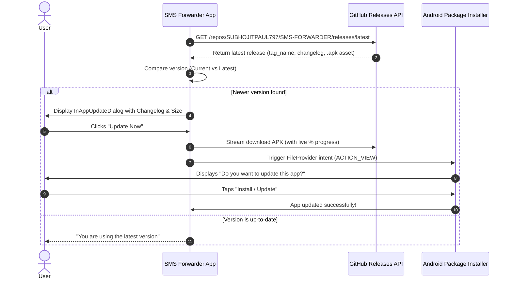

# 🚀 SMS Forwarder (Bridge) - Update, Release & Architecture Guide

This documentation serves as the complete guide for building, releasing, and updating **SMS Forwarder (Bridge)**.

---

## 📌 Table of Contents
1. [In-App GitHub Auto-Updater Architecture](#1-in-app-github-auto-updater-architecture)
2. [Step-by-Step Guide: Publishing a New Update](#2-step-by-step-guide-publishing-a-new-update)
3. [Building the APK Locally via Gradle CLI](#3-building-the-apk-locally-via-gradle-cli)
4. [Firestore Security & Permissions](#4-firestore-security--permissions)

---

## 1. In-App GitHub Auto-Updater Architecture

The application includes an in-app updater connected directly to the official GitHub repository releases (`SUBHOJITPAUL797/SMS-FORWARDER`).



### Key Updater Features:
1. **Automatic Startup Check**: Whenever the app opens, it silently checks for updates in the background.
2. **Manual Check**: Users can tap the **Update Icon** in the top bar of both Host & Client screens.
3. **In-App Direct Download**: Streams the APK bytes with a live progress bar, downloaded MB / total MB indicator, and non-blocking coroutines.
4. **Automatic System Install Trigger**: Once the APK is downloaded into cache, Android's `FileProvider` (`REQUEST_INSTALL_PACKAGES`) triggers the package installer.

---

## 2. Step-by-Step Guide: Publishing a New Update

Whenever you add new features or fix bugs, follow these 3 steps:

### 🔹 Step 1: Bump the Version
Open `app/build.gradle.kts`:
```kotlin
android {
    defaultConfig {
        versionCode = 2          // Increment by 1
        versionName = "1.0.1"    // Bump semantic version
    }
}
```

### 🔹 Step 2: Build the APK
```powershell
.\gradlew.bat assembleDebug
# or for release:
.\gradlew.bat assembleRelease
```
The APK will be generated at:
`app\build\outputs\apk\debug\app-debug.apk`

### 🔹 Step 3: Publish GitHub Release
```powershell
gh release create v1.0.1 .\sms-forwarder-v1.0.1.apk --title "SMS Forwarder v1.0.1" --notes "• Bug fixes and improvements."
```
Once published on GitHub, all installed apps will automatically notify users and allow 1-tap in-app updating!
